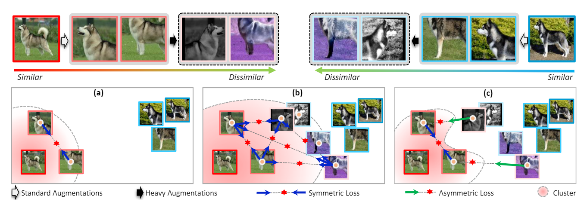
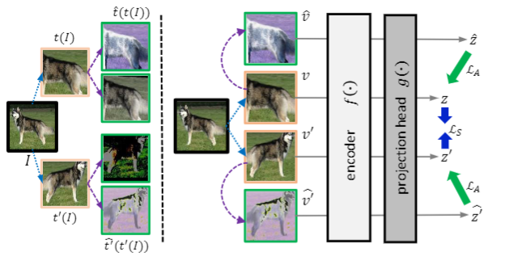
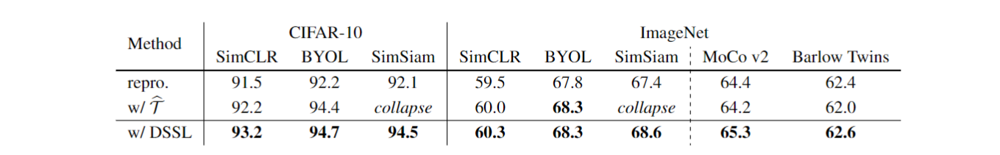
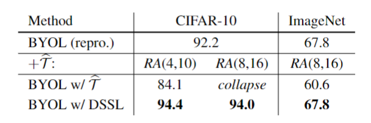

# DSSL

Here's the official repo for [Directional Self-supervised Learning for Heavy Image Augmentations](https://openaccess.thecvf.com/content/CVPR2022/papers/Bai_Directional_Self-Supervised_Learning_for_Heavy_Image_Augmentations_CVPR_2022_paper.pdf) [CVPR2022]

Folder contents:
* Simsiam_cifar10: implementation of DSSL+SimSiam on cifar10.
* Simsiam_imagenet: implementation of DSSL+SimSiam on Imagenet 1K.
* Byol_harder -aug_imagenet: Implementation of DSSL+BYOL on Imagenet 1K. To show more contents, the Augumention here use setting in Table 3. 

Usage:
* Training:

    `python run.py`

* Evalution:

    `python test_runer.py`
  (Only for imagenet code,  in CIFAR10 code evaluation is carried out at the same time with training）

Overview of standard self-supervised learning and our DSSL. Original standard image transformations generate the standard
views, and the harder view is derived from the the standard view by applying heavy augmentation RandAugment. (a) Standard instance-
wise learning with standard views. (b) Instance-wise self-supervised learning after introducing heavily augmented (harder) views. Applying
symmetric loss to maximize the similarity between standard and heavily augmented views roughly expands the feature cluster in the visual
embedding space. The model may confuse the instance-level identity. (c) DSSL: To prevent the adverse effect from missing information
of heavily augmented views, DSSL avoids arbitrarily maximizing their visual agreement. To tighten the feature cluster, DSSL applies an
asymmetric loss for only gathering each heavily augmented view to its relevant standard view.

Illustration of our directional self-supervised learn-
ing (DSSL) framework. Left: Construction of partially ordered
views. Right: Symmetric loss LS for bidirectionally maximizing
the agreement among augmented view pairs sampled from VT
remains same. Asymmetric loss LA is proposed for encouraging
the representations of the heavily augmented views to be close to
their source standard views, respecting the partially ordered rela-
tionship in VT → ̂ T

Comparisons on linear evaluation accuracies (%). repro: our reproduction of each method. collapse: model collapsed during
training. w/ ̂ T : training views are jointly augmented from standard and heavy augmentations. Heavy augmentations perform unstably even
model collapsing, while DSSL consistently benefits from ̂ T 

Linear evaluation accuracies (%) of BYOL by applying
more heavy augmentations (+ ̂T ).
